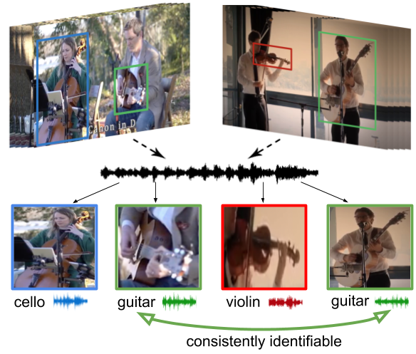

## Co-Separating Sounds of Visual Objects
[[Project Page]](http://vision.cs.utexas.edu/projects/coseparation/)    [[arXiv]](https://arxiv.org/abs/1904.07750) [[Video]](https://www.youtube.com/watch?v=Tdm5K65WL2I) <br/>



<br/>

[Co-Separating Sounds of Visual Objects](https://arxiv.org/abs/1904.07750)  
 [Ruohan Gao](https://www.cs.utexas.edu/~rhgao/)<sup>1</sup> and [Kristen Grauman](http://www.cs.utexas.edu/~grauman/)<sup>1,2</sup> <br/>
 <sup>1</sup>UT Austin, <sup>2</sup>Facebook AI Research  
 In International Conference on Computer Vision (**ICCV**), 2019  
 
<br/>

If you find our code or project useful in your research, please cite:

     @inproceedings{gao2019coseparation,
       title = {Co-Separating Sounds of Visual Objects},
       author = {Gao, Ruohan and Grauman, Kristen},
       booktitle = {ICCV},
       year = {2019}
     }

### Generate noisy object detections
We use the public PyTorch implementation of Faster R-CNN (https://github.com/jwyang/faster-rcnn.pytorch) to train an object detector with a ResNet-101 backbone. The object detector is trained on ∼30k images of 15 object categories from the Open Images dataset. The 15 object categories include: Banjo, Cello, Drum, Guitar, Harp, Harmonica, Oboe, Piano, Saxophone, Trombone, Trumpet, Violin, Flute, Accordion, and Horn. The pre-trained detector is shared at [Google Drive](https://drive.google.com/drive/folders/1K9DdSu7fK0rVmVbdvTgulOwDQHzxbBsK?usp=sharing). Please refer to https://github.com/jwyang/faster-rcnn.pytorch for instructions on how to use the pre-trained object detector or train a new detector on categories of your interest. Use the pretrained-detector to generate object detections for both training and testing set, and save the object detection results of each video as one .npy file under /your_data_root/detection_results/. 

The training data we use are 10s video clips. 80 frames are extracted at 8 fps from each 10s clip. Each .npy file contains the pooled object detections from these 10 frames. Audio segment is randomly cropped from the corresponding 10s clip during training. Each .npy file should contain all the object detections for that video video with each detection represented by 7 numbers (frame_index,class_id,confidence_score,four bounding box coordinates). See getDetectionResults.py for examples on how to obtain the .npy file. See [Supp.](http://vision.cs.utexas.edu/projects/coseparation/coseparation-iccv2019-supp.pdf) for how we reduce the noise of the obtained detections. A script (getTopDetections.py) is provided for object detection data cleaning.

### Co-Separation training
Use the following command to train your co-separation model:
```
export CUDA_VISIBLE_DEVICES=0,1,2,3,4,5,6,7
python train.py --name audioVisual --hdf5_path /your_root/hdf5/soloduet/ --scene_path /your_root/hdf5/ADE.h5 --gpu_ids 0,1,2,3,4,5,6,7 --batchSize 80 --nThreads 32 --display_freq 10 --save_latest_freq 500 --niter 1 --validation_freq 200 --validation_batches 20 --num_batch 35000 --lr_steps 15000 30000 --classifier_loss_weight 0.05 --coseparation_loss 1 --unet_num_layers 7 --lr_visual 0.00001 --lr_unet 0.0001 --lr_classifier 0.0001 --weighted_loss --visual_pool conv1x1 --optimizer adam --log_freq True --with_additional_scene_image --tensorboard True --validation_visualization True |& tee -a log.txt
```
Note: The hdf5 files contains the paths to the obtained object detections (.npy files) for each video. See sample_hdf5.zip in [Google Drive](https://drive.google.com/drive/folders/1K9DdSu7fK0rVmVbdvTgulOwDQHzxbBsK?usp=sharing) for examples of the format of hdf5 files.

### Co-Separation testing
Use the following command to mix and separate two solo videos using the your trained co-separation model or the [shared model](https://drive.google.com/drive/folders/1K9DdSu7fK0rVmVbdvTgulOwDQHzxbBsK?usp=sharing) pre-trained on MUSIC dataset:
```
python test.py --video1_name video1_name --video2_name video2_name --visual_pool conv1x1 --unet_num_layers 7 --data_path /your_data_root/MUSIC_dataset/solo/ --weights_visual pretrained_models/audioVisual/visual_latest.pth --weights_unet pretrained_models/audioVisual/unet_latest.pth --weights_classifier pretrained_models/audioVisual/classifier_latest.pth  --num_of_object_detections_to_use 5 --with_additional_scene_image --scene_path /your_root/hdf5/ADE.h5 --output_dir_root results/
```

### Evaluate separation results
Use the following command to obtain the SDR, SIR, SAR of the separation results:
```
python evaluateSeparation.py --results_dir /your_separation_output_dir
```

### Acknowlegements
Thanks to [Dongguang You](https://github.com/dgynick) for help with initial experiments setup. Portions of the code are adapted from the 2.5D Visual Sound implementation (https://github.com/facebookresearch/2.5D-Visual-Sound) and the Sound-of-Pixels implementation (https://github.com/hangzhaomit/Sound-of-Pixels). Please also refer to the original License of these projects.


### Licence
The code in this repository is CC BY 4.0 licensed, as found in the LICENSE file.
